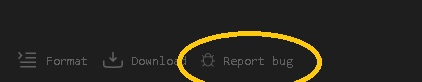
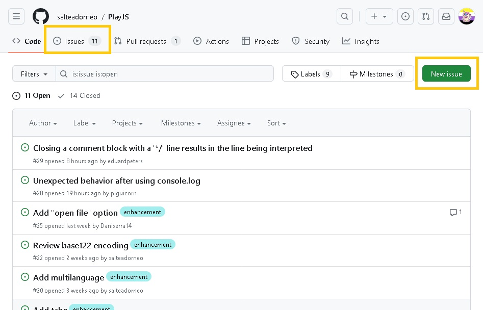

# How to Contribute to PlayJS

There are many ways you can contribute to the growth of this project: adding features, fixing bugs (or reporting them), etc.

## Reporting a Bug without a Github account

If you find something that is not working while using PlayJS, simply click on the "Report a Bug" button on the bottom menu of the application and fill the form.  

## Opening a new issue

Issues are a good way to report bugs, but also suggest new features and more.

To open an issue, visit the project repository and go to the Issues tab. Here, click on "New Issue" and a form will open. 

Only the title is mandatory, but we encourage you to write a description as detailed as possible so others can understand what the problem or the suggestion you are trying to communicate is.

The Wiredcraft team wrote a post explaining [how they write Github issues](https://wiredcraft.com/blog/how-we-write-our-github-issues/) that may help.

## Creating a Pull Request

1. Fork the project repository. This will create a copy with you as the owner.
2. Follow the [instructions to setup PlayJS](README.md) on your local machine.
3. Create and commit the changes you would like to suggest.
4. Push them to the remote repository.
5. Follow the official Github documentation ["Creating a pull request from a fork"](https://docs.github.com/en/pull-requests/collaborating-with-pull-requests/proposing-changes-to-your-work-with-pull-requests/creating-a-pull-request-from-a-fork).
6. Wait for your changes to be accepted. 🎉

We suggest you let others know when you work on an open issue before starting or creating the pull request, so you make sure nobody else will be working on the same tasks.